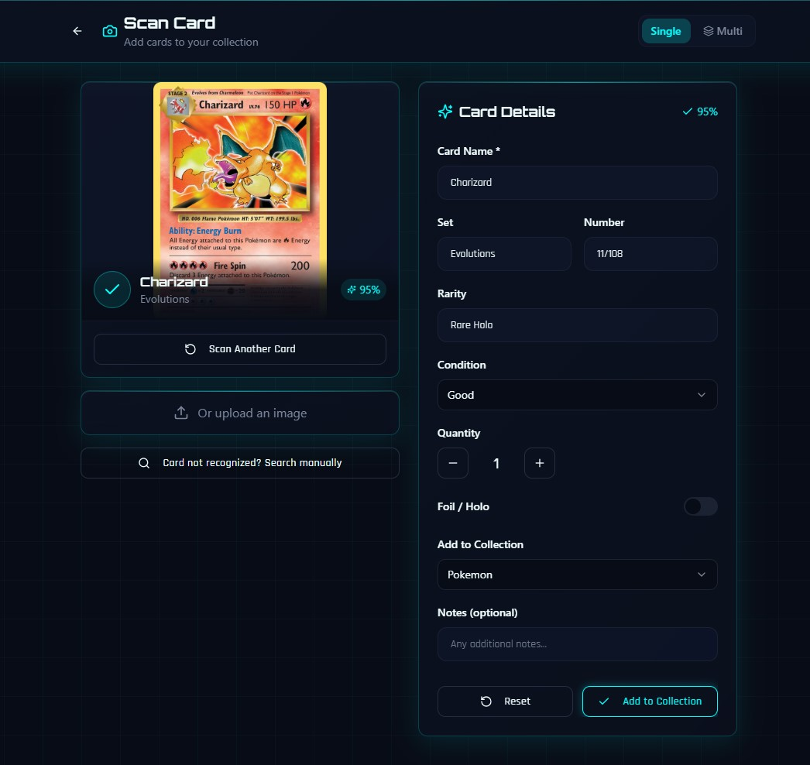
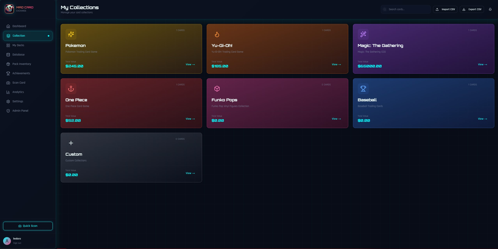
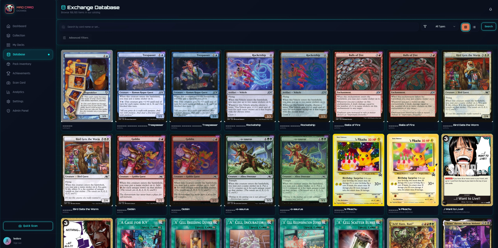
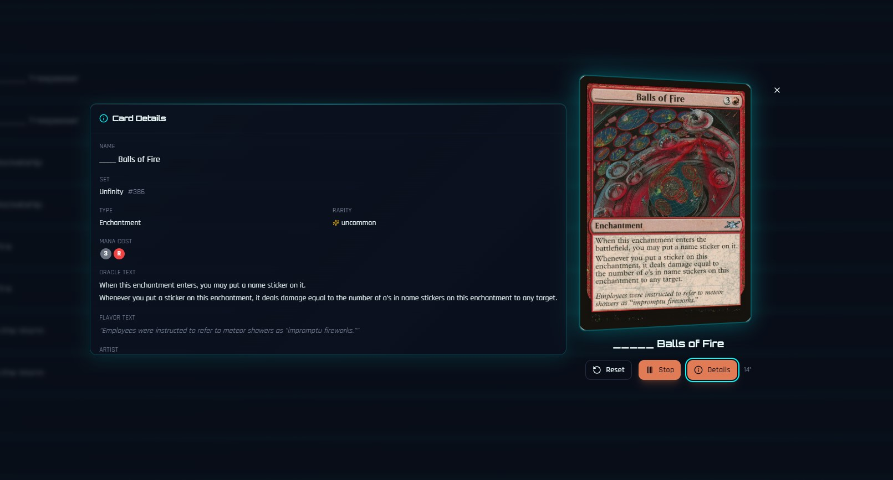
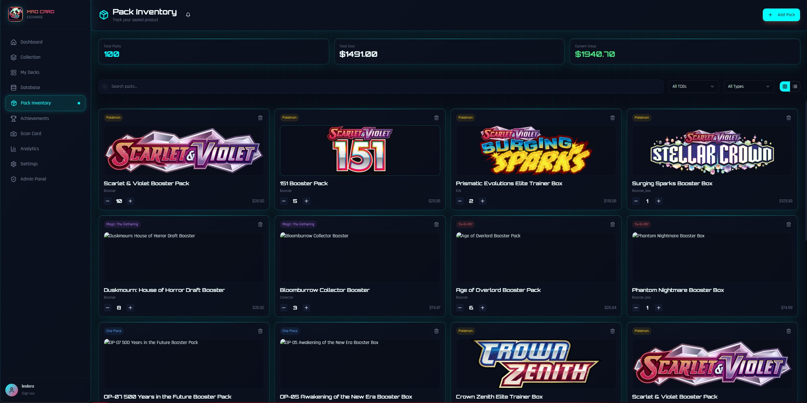
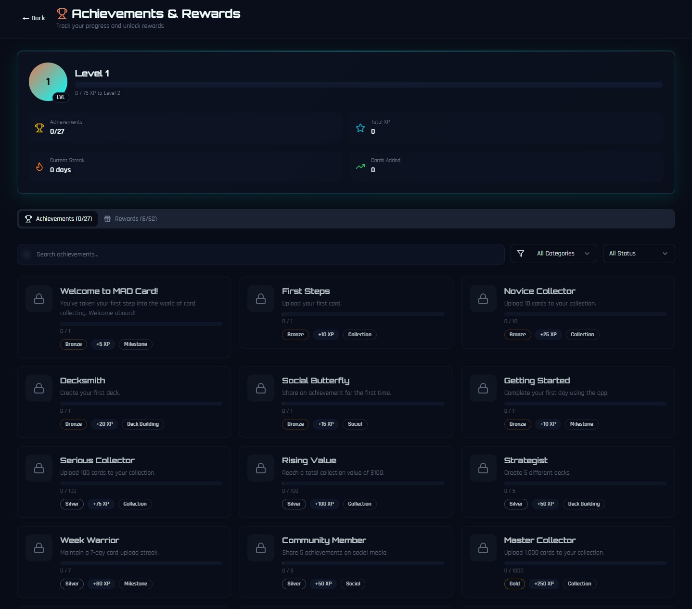
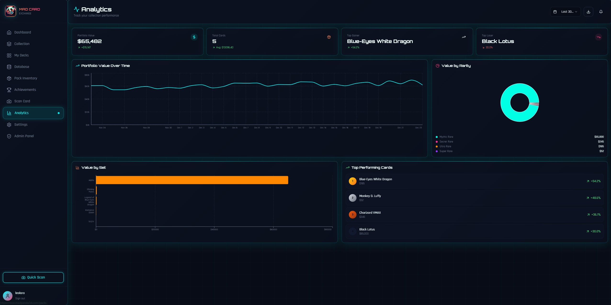

<p align="center">
  
</p>

<h1 align="center">MAD Card Exchange</h1>
<p align="center">Scan, identify, and track your collection in seconds.</p>

<p align="center">
  <a href="https://mce-promp.madpanda3d.com">
    
  </a>
  <a href="https://mce-promp.madpanda3d.com">
    
  </a>
</p>

<p align="center">
  <a href="https://github.com/MADPANDA3D/MAD-CARD-EXCHANGE-PUBLIC">
    
  </a>
  <a href="https://github.com/MADPANDA3D/MAD-CARD-EXCHANGE-PUBLIC/fork">
    
  </a>
  <a href="https://github.com/MADPANDA3D/MAD-CARD-EXCHANGE-PUBLIC/commits/main">
    
  </a>
  
</p>

## What this is

MAD Card Exchange is a modern trading card collection platform built for speed, clarity, and visual impact. It helps collectors capture cards fast, keep collections clean, and see their progress at a glance.

## Why collectors love it

- Fast card capture with guided framing and flexible scan modes
- Multi-TCG collections with custom organization and featured slots
- Exchange database browsing for deep catalog discovery
- 3D card viewer for rich inspection
- Pack inventory tracking for sealed products
- Value insights, trends, and achievements that reward progress

## Built for

- Collectors who want a clean, visual-first catalog
- Shops and sellers who need fast inventory clarity
- Communities that want a shared view of sets and value

## Demo

```
+------------------------------------------------------------------+
| DEMO VIDEO - Coming soon                                         |
| Drop your Loom/YouTube/Vimeo link here to replace this box.      |
+------------------------------------------------------------------+
```

## Screenshots

Highlights from the current build.

### Scan and identify


Scan your cards the way that feels effortless. Line up the card in the on-screen frame and it snaps instantly, or tap to capture whenever you want. Auto or manual, the scan flow adapts to how you like to collect.

### Collections and organization


Group cards by game, set, deck, or custom themes. Pin highlights, surface favorites, and keep the collection clean as it grows.

### Exchange database


Explore the full catalog with a visual browse experience built for discovery. Find new cards, track sets, and compare editions fast.

### 3D card viewer


Inspect cards in a rich, interactive view that makes surface detail and presentation pop.

### Pack inventory


Track sealed products alongside your singles so your entire collection lives in one place.

### Achievements and rewards


Celebrate milestones and progress with achievements that make collecting more fun.

### Value insights and trends


See your collection at a glance with trend views that help you understand progress over time.

## How it feels

- Scan fast, stay in flow
- Organize with clarity
- Explore new cards and sets
- Track your collection progress

## Support and beta access

<p align="center">
  <a href="https://mce-promp.madpanda3d.com">
    
  </a>
  <a href="https://mce-promp.madpanda3d.com">
    
  </a>
</p>

## License

All rights reserved. This project is proprietary.

<p align="center">
  
  <br />
  <em>Built by MADPANDA3D</em>
</p>
